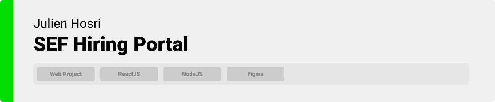
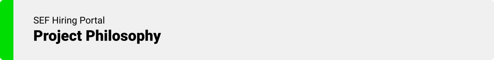

> Hello world! This is the project’s summary that describes the project plain and simple, limited to the space available. 


### Table of content

**[PROJECT PHILOSOPHY](https://github.com/julescript/well_app#-project-philosophy) • [WIREFRAMES](https://github.com/julescript/well_app#-wireframes) • [TECH STACK](https://github.com/julescript/well_app#-tech-stack) • [IMPLEMENTATION](https://github.com/julescript/well_app#-impplementation) • [HOW TO RUN?](https://github.com/julescript/well_app#-how-to-run)**

  

> The Well app is a mental health and mindfulness app built on top of the science of positive psychology. The Well app is more than just another meditation or journaling app; it encourages you to enhance and reflect on your day with structured, guided activities.
> 
> There are 5 daily tasks that the Well app asks you to complete each day: record 3 gratitudes, write a journal entry, perform 3 acts of kindness, exercise for 20 minutes, and meditate for 15 minutes.

### User Stories
- As a user, I want to browsse ablums, so that I can find quick links
- As a user, I want to browsse ablums, so that I can find quick links
- As a user, I want to browsse ablums, so that I can find quick links

  

> This design was planned before on paper, then moved to Figma app for the fine details.
Note that i didn't use any styling library or theme, all from scratch and using pure css modules

| Landing  | Home/Search  |
| -----------------| -----|
|  |  |

| Artists results  | Artist's Albums  |
| -----------------| -----|
|  |  |

  

Here's a brief high-level overview of the tech stack the Well app uses:

- This project uses the [Flutter app development framework](https://flutter.dev/). Flutter is a cross-platform hybrid app development platform which allows us to use a single codebase for apps on mobile, desktop, and the web.
- For persistent storage (database), the app uses the [Hive](https://hivedb.dev/) package which allows the app to create a custom storage schema and save it to a local database.
- To send local push notifications, the app uses the [flutter_local_notifications](https://pub.dev/packages/flutter_local_notifications) package which supports Android, iOS, and macOS.
  - 🚨 Currently, notifications aren't working on macOS. This is a known issue that we are working to resolve!
- The app uses the font ["Work Sans"](https://fonts.google.com/specimen/Work+Sans) as its main font, and the design of the app adheres to the material design guidelines.

For more information on the technologies that power the Well app, check out the [Tech Stack](https://github.com/chroline/well_app/wiki/Tech-Stack) page on our wiki.

  

  

